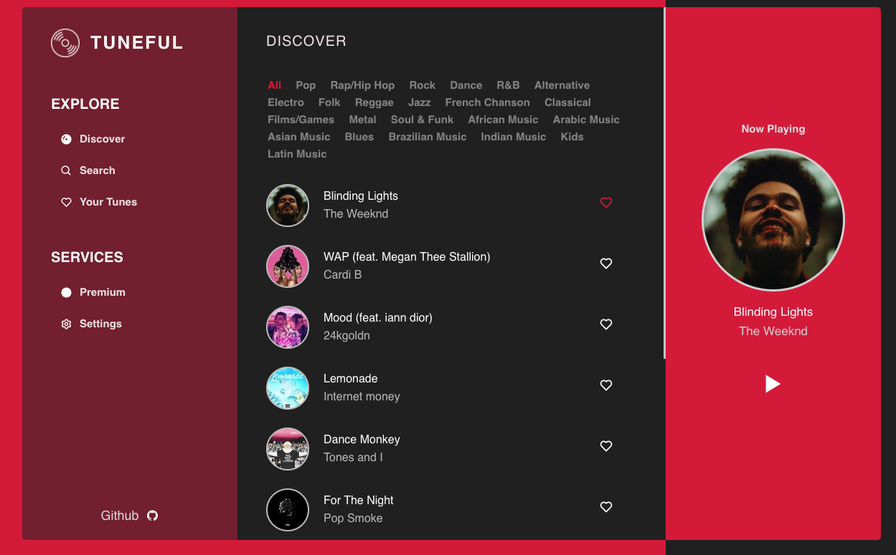

# TuneFul

This is a JavaScript project developed with ReactJs. The React version of [Tunein VueJs] by [Datlyfe](https://github.com/Datlyfe/tuneIn/commits?author=Datlyfe).

I challenged myself to turn the app into a React app from Vue framework.

Tuneful is a simple and elegant music discovery app

⭐ the repo if you like it.

## Getting Started 🚀

In the project directory, you can run:

### `yarn start`

Runs the app in the development mode. 
Open [http://localhost:3000](http://localhost:3000) to view it in the browser.

### `yarn test`

Launches the test runner in the interactive watch mode. 
See the section about [running tests](https://facebook.github.io/create-react-app/docs/running-tests) for more information.

### `yarn build`

Builds the app for production to the `build` folder. 
It correctly bundles React in production mode and optimizes the build for the best performance.

The build is minified and the filenames include the hashes. 
Your app is ready to be deployed!

## Preview 📸

### https://tuneful.netlify.app/

